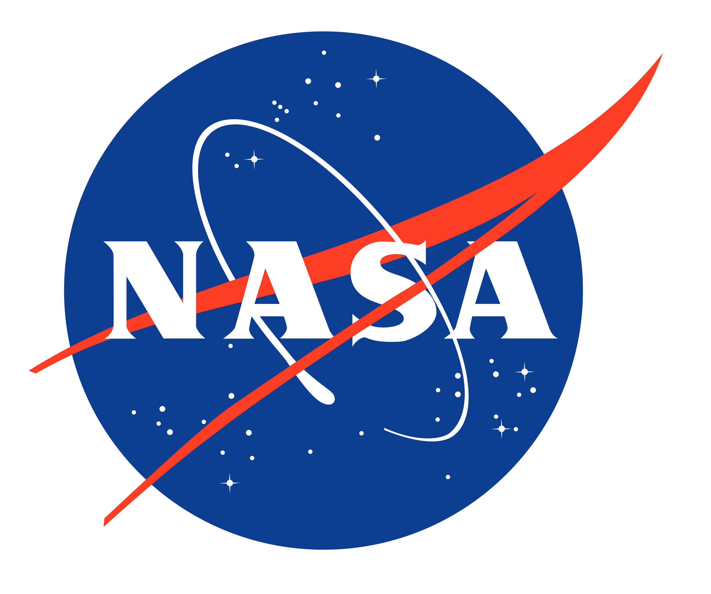

# Nasapi

Interface Web pour [api.nasa.gov ](https://api.nasa.gov/)



Ce projet est réalisé par @AmeliDa et @mortellaro

```
┌──────────────┬──────────────────┐ 
│ Mandant      │ Laurent Pizzolon │
├──────────────┼──────────────────┤
│ Mandataire   │ Alan Mortellaro, │ 
│              │ Darwin Ameli     │
├──────────────┼──────────────────┤
│ Entreprise   │ CPNE             │
└──────────────┴──────────────────┘
```
- [Nasapi](#nasapi)
  - [1. Préface](#1-préface)
  - [2. Description](#2-description)
  - [3. Délais](#3-délais)
  - [4. Budget](#4-budget)
  - [5. Livrables](#5-livrables)
  - [6. Contribution](#6-contribution)
  - [7. Installation](#7-installation)
  - [8. License](#8-license)

## 1. Préface
Dans le cadre du cours Laboratoire de notre deuxième année de Technicien en informatique, Laurent Pizzolon nous a demandé d'analyser et développer un projet sur la totalité du cours.

Nous avons donc à disposition **130 périodes** de **45 minutes** par groupe de deux étuditants. Le projet doit être relatif à notre formation et doit se dérouler au plus proche de la réalité en entreprise ainsi que du professionalisme qui l'incombe.

## 2. Description
Nasapi est une interface web developpé en React. Elle permettra de rechercher des données, mises à disposition par la Nasa, intuitivement afin rendre accessible des informations sur le domaine spatiale.

## 3. Délais 

La date de livraison du livrable est le **22 juin 2023**.

Une présentation du livrable auprès du Mandant le **29 juin 2023** dernier délais.

## 4. Budget

Tarif horaire : 0 CHF/h


## 5. Livrables

L'application sera livrée par itération de fonctionnalités. Au terme d'un groupe de fonctionnalité, un rendez-vous avec le Mandant sera agendé pour tester l'application et verifier la bonne direction de l'application afin qu'elle continue de répondre aux attentes du Mandant.

- Sprint 1 : Début Avril - 19h de travail (14 mars - 6 avril)
- Sprint 2 : Début Mai - 19h de travail (24 avril - 11 mai)
- Sprint 3 : Début Juin - 19h de travail (15 mai - 5 juin)
- Sprint 4 : Fin Juin - 19h de travail (8 juin - 22 juin)

D'ici fin juin nous avons **76h** de travail à disposition à **deux** employés à **10%** puis **20%** pour un total de **152h**.

```
┌────────────────┬──────┐ 
│ Sprint 1/2/3/4 │ 152h │
├────────────────┼──────┤
│ Présentation   │  2h  │
├────────────────┼──────┤
│ Deadline       │ 160h │
├════════════════┼══════┤
│ Somme(Marge)   │  6h  │
└────────────────┴──────┘
```

## 6. Contribution

Les "Pull requests" sont les bienvenues. Pour les changements majeurs, veuillez d'abord ouvrir une question
pour discuter de ce que vous aimeriez changer.

## 7. Installation 

Pour contribuer, il faut installer l'environnement de développement :

- Installer [VSCode](https://code.visualstudio.com/)
- Installer [NodeJS](https://nodejs.org/en/) - ici nous utilisons la version 18.15.0 LTS

Les autres dépendances sont déjà décrites dans le projet grâce au [package.json](./nasapi/package.json)

Pour les installer il faut utiliser un outil qui va déployer ces dépendances : pnmp

```powershell
PS C:\...\nasapi\nasapi> npm install -g pnpm

PS C:\...\nasapi\nasapi> pnpm install

PS C:\...\nasapi\nasapi> npm start
```

Une fenêtre qui pointe sur le localhost:3000 devrait s'ouvrir avec le projet compilé dedans.

## 8. License

[MIT](https://choosealicense.com/licenses/mit/)